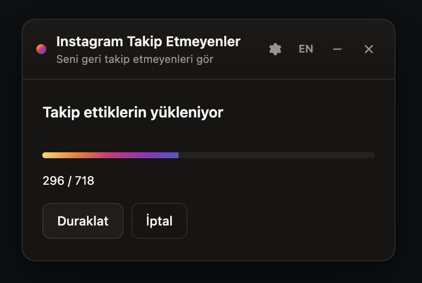

<p align="center">
  
</p>

<p align="center">
  Find the Instagram accounts that do not follow you back.<br>
  In your own browser tab, in your own session, with no password given to anyone.
</p>

<p align="center">
  <a href="https://instagram.cobanov.dev">instagram.cobanov.dev</a> ·
  <a href="https://instagram.cobanov.dev/security.html">how to verify it</a>
</p>

<p align="center">
  <a href="https://github.com/cobanov/instagram/releases/latest"></a>
  
  
  <a href="https://github.com/cobanov/instagram/actions/workflows/semgrep.yml"></a>
</p>

---

Every tool that answers this question wants something first: your password, an OAuth
grant, or your follower list uploaded to somewhere you cannot see. None of that is
needed. Instagram already makes your following and follower lists available to the
logged-in browser. The whole job is comparing those lists inside the tab.

So this is a script you paste into your own DevTools console on your own Instagram
tab. It uses the session already in the browser. Nothing is sent anywhere: the site
is static, and there is no server on this side to receive anything.

- **It compares both lists locally.** The scanner reads your following and follower
  lists from Instagram, then compares their user IDs inside the tab.
- **Nothing leaves the tab.** No backend, no upload, no key. What the panel shows is
  what the browser already had.
- **Unfollowing is slow on purpose.** Rate limits, blocks and `checkpoint_required`
  are detected and stop the run rather than being retried into a ban.
- **A floating panel, TR and EN**, with search, filters, hide/unhide and copy.
- **The exact bytes are published and scanned.** The security page shows the SHA-256
  of the file it is serving, and links to the VirusTotal report for that hash.

## Install

Two ways to run it. They execute the same file, byte for byte.

**The console snippet.** Sign in at `https://www.instagram.com`, open DevTools
Console, copy the snippet from [instagram.cobanov.dev](https://instagram.cobanov.dev),
paste it and press Enter. If Chrome refuses the paste, type `allow pasting` in the
console first.

**The Chrome extension**, if you would rather not touch a console. Download the zip
from the [latest release](https://github.com/cobanov/instagram/releases/latest),
unpack it, and load it unpacked from `chrome://extensions` with developer mode on.
Clicking its toolbar icon injects the same script. Contributed by
[yavuzmeteafsar](https://github.com/yavuzmeteafsar); see
[chrome-extension/README.md](chrome-extension/README.md).

## Use

Click **Scan now**. The panel walks your following and follower lists, then shows the
accounts present only in your following list.

Instagram hands followers out about 24 per page, so a large account is a few hundred
requests and several minutes. Keep the tab in front while it runs: Chrome slows a
background tab's timers to one per minute. If Instagram cuts the scan short (signs
you out, rate-limits, asks for a checkpoint), what was loaded is kept in the tab's
`localStorage` for a day and shown with a warning. Sign back in, paste again and press
**Resume**; the scan continues from the last page instead of starting over.

Unfollowing from the panel is deliberately unhurried. Instagram answers a burst of
unfollows with `feedback_required`, a spam flag, a checkpoint, or an HTTP 429, and
each of those is treated as a stop rather than as something to retry. An HTTP 401
means the session died and also stops the run. Pushing through any of them is how
accounts get restricted.

## How to verify it before pasting

Pasting a stranger's JavaScript into a logged-in Instagram tab is a real thing to be
careful about, so the point of the security page is to make the file checkable rather
than to ask for trust.

```sh
npm run build      # prints the SHA-256 it just wrote
shasum -a 256 dist/instagram-unfollower.one-line.js
```

That value must match the hash shown on
[security.html](https://instagram.cobanov.dev/security.html). The page derives its
hash from the bytes it is actually serving rather than from a constant in this
repository, so it cannot go stale and vouch for a file nobody is downloading, and
the VirusTotal link is built from that same hash. The live VirusTotal summary is
fetched through `/api/virustotal`, a Cloudflare function holding the API key, so the
key never reaches the browser. `src/instagram-unfollower.js` is the source of all of
it and is short enough to read.

The extension's copy is generated by the same build step rather than hand-copied, so
it is byte-identical to `dist/` and the published hash verifies it too.

## Development

```
npm run build   # bundles src/ into dist/ and writes the new snippet hash
npm run check   # syntax check plus the 27 tests
npm run vt      # submits the built snippet to VirusTotal
npm run pack    # builds, then zips chrome-extension/ into .pack/ for a release
```

The tests cover the part that is genuinely dangerous: what counts as a successful
unfollow, and which failures must stop the run. An HTTP 200 carrying
`status: "fail"`, an HTML login page served with 200, a spam flag, a checkpoint, a
429 and a 401 are each asserted to be handled as themselves rather than as generic
retryable errors. The scan tests cover the current friendship-list endpoints,
pagination, repeated-cursor protection, and the local following/follower comparison.
The rest check that no language file is missing a key or leaves one empty.

Every build produces a new hash, and the security page reports a hash VirusTotal has
never seen as unscanned. `npm run vt` closes that gap: run it after any build that
changes `dist/`. It drives the public upload form in a browser rather than the API,
so there is no VirusTotal key to keep locally, and it needs Playwright, which is not
a project dependency:

```
npm i -g playwright && npx playwright install chrome
```

The browser window is visible on purpose. Headless Chrome opens the upload dialog but
never completes the submission.

## Sponsorship

Around **53.8k unique visitors per 30 days**, on the March 26 to April 25, 2026
Cloudflare Analytics snapshot.

If it is useful to you, you can sponsor it at
[github.com/sponsors/cobanov](https://github.com/sponsors/cobanov).

Thanks to the people who have backed it:

- [rmncr](https://github.com/rmncr), $25
- [Fatih Guzel](https://www.instagram.com/fatihguzeldev/), $10
- [Woosal](https://www.instagram.com/woosal1337/), $10

## Prior art

The workflow comes from
[davidarroyo1234/InstagramUnfollowers](https://github.com/davidarroyo1234/InstagramUnfollowers).
